# RAK12003 based contactless IR temperature sensor example
|  |  |  |
| :-: | :-: | :-: |
| 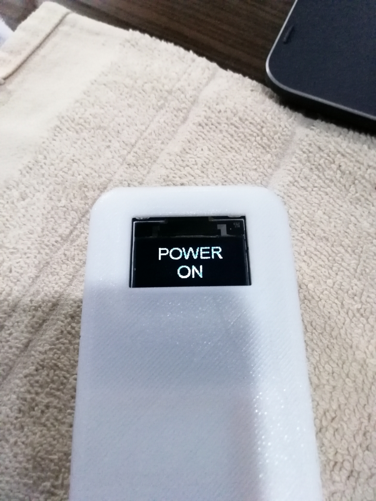  | 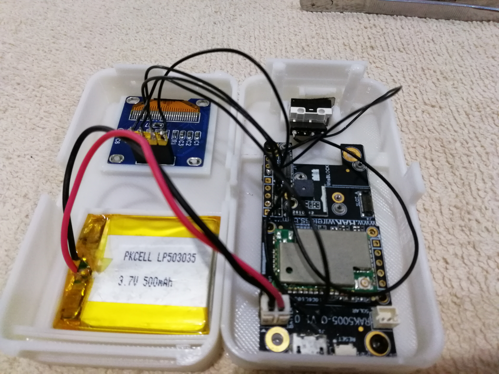  | 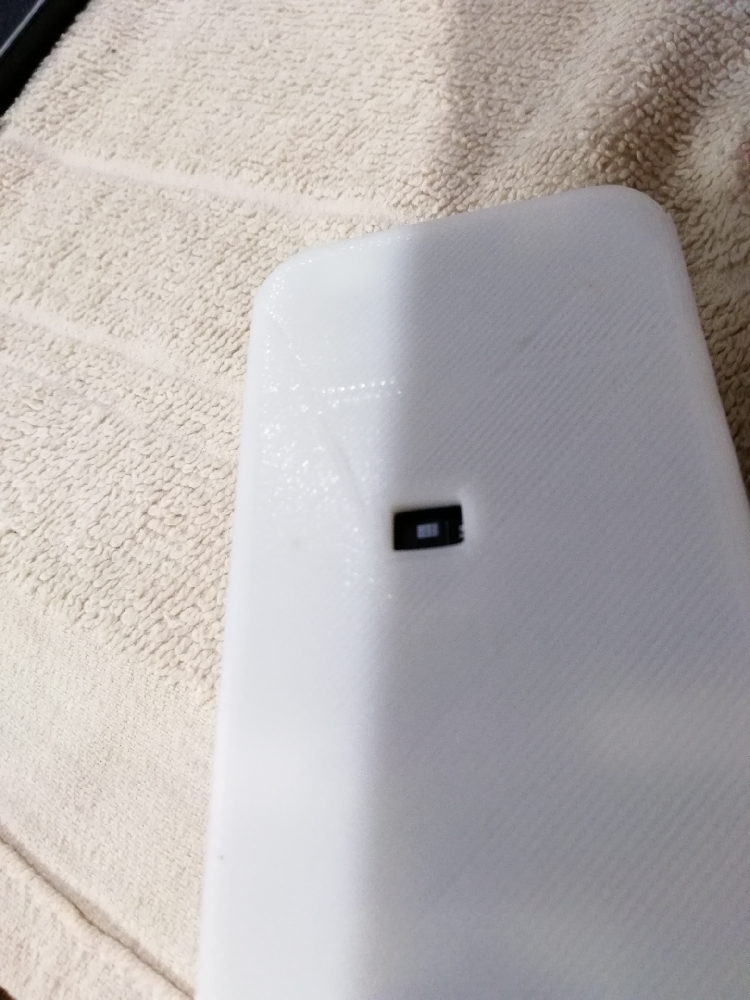  |


|  |  |
| :-: | :-: |

This example shows:
- How to use the RAK12003 to measure temperatures and display the values on an OLED display
- How to use BLE **H**ealth **T**emperature **M**onitor (HTM) service to send measured temperature over BLE

**This example does not use LoRa or LoRaWAN communication**

## Content
- [Hardware setup](#hardware-setup)
   - [Used WisBlock parts](#used-wisblock-parts)
   - [Other parts used](#other-parts-used)
- [Software setup](#software-setup)
- [Required tools](#required-tools)
- [Source code](#source-code)
   - [Setup and main loop](#setup-and-main-loop)
   - [IR sensor functions](#ir-sensor-functions)
   - [Display functions](#display-functions)
   - [BLE functions](#ble-functions)
- [Hardware](#hardware)
- [Enclosure](#enclosure)

----

## Hardware setup
### Used WisBlock parts
- [RAK5005-O base board](https://docs.rakwireless.com/Product-Categories/WisBlock/RAK5005-O/Overview/)
- [RAK4631 core module](https://docs.rakwireless.com/Product-Categories/WisBlock/RAK4631/Overview/)
- [RAK12003 IR temperature sensor](https://docs.rakwireless.com/Product-Categories/WisBlock/RAK12003/Overview/)
- [RAK18001 Buzzer module](https://docs.rakwireless.com/Product-Categories/WisBlock/RAK18001/Overview/)
- [RAK1921 OLED display](https://docs.rakwireless.com/Product-Categories/WisBlock/RAK1921/Overview/)

### Other parts used
- Button to trigger measurement
- 3D printed enclosure
- 500mAh LiPo battery, flat type required for proposed enclosure

----

## Software setup
The example software is written based on Arduino, but uses the PlatformIO IDE. The complete source code is available here. The source code can be easily transfered to be compiled with Arduino IDE.
Three additional libraries are required for the application:
- [SparkFun MLX90632 Noncontact Infrared Temperature Sensor](https://github.com/sparkfun/SparkFun_MLX90632_Arduino_Library)
- [SX126x-Arduino](https://github.com/beegee-tokyo/SX126x-Arduino)
- [nRF52 OLED](https://github.com/beegee-tokyo/nRF52_OLED)

When using the project in PlatformIO, these libraries are installed automatically when you compile it. In Arduino IDE you have to install the libraries with the **Library Manager**

----

## Required tools
- PlatformIO
  - optional Arduino IDE
- Adafruit nRF52 platform package, [patched for RAK4631](https://github.com/RAKWireless/WisBlock/tree/master/PlatformIO/RAK4630)
  - optional (for Arduino IDE) [RAK-nRF52-Arduino BSP](https://github.com/RAKWireless/RAK-nRF52-Arduino)
- For BLE connection the [nRF52 Toolbox](https://play.google.com/store/apps/details?id=no.nordicsemi.android.nrftoolbox) from Nordic is needed to show the temperature measurements

----

## Source code
The source code is split into 4 parts:
- [Setup and main loop](#setup-and-main-loop)
- [IR sensor functions](#ir-sensor-functions)
- [Display functions](#display-functions)
- [BLE functions](#ble-functions)

### Setup and main loop
The code is written for lower power consumption. To achieve this, the USB serial should not be initialized in **`setup()`**. However, for debugging output this can be enabled or disabled by setting **`#define MY_DEBUG 0`** in **`main.h`**.    

Another important step for low power consumption is as well to initialize the integrated LoRa transceiver of the RAK4631 and force it into _sleep_ mode. This is necessary, because after a power-up or reset the SX1262 LoRa transceiver stays in _stand-by_ mode, which consumes more energy than the _sleep_ mode. 

The Arduino **`loop()`** task is waiting for an event that needs handling. Sources for such events use a binary semaphore. By giving the semaphore together with a flag that indicates what event happened wakes up the **`loop`** task.
Waiting for a semaphore that signals an event is equal to _sleeping_ on FreeRTOS. This means, if no events are happening, the nRF52 MCU goes into sleep mode to reduce the power consumption.

Two events can give the semaphore and trigger a wakeup of **`loop()`**.
- The button was pushed and triggered the IRQ handler **`void button_trigger(void)`**
- A BLE device connected and triggers a continous temperature reading be enabling **`indication`**.

If the button was pushed, the **`loop`** wakes up and performs a 10 seconds long reading of the IR temperature sensor. After the 10 seconds, the average temperature of these readings is displayed on the OLED display. At this point the **`loop`** goes back to sleep. A timer events powers off the OLED display after 30 seconds. The begin and end of a measure cycle is indicated with a beep signal from the RAK18001 buzzer module.

If a device connected over BLE and requested sensor data by setting the BLE **`indication`** flag, the **`loop`** wakes up as well and performs in an interval of 1 second temperature reading. These readings are sent over BLE to the connected device. The **`loop`** stays awake while the BLE device is connected. Once the BLE device disconnects, the temperature readings are stopped and the **`loop`** goes back to sleep. During the BLE connection the button is disabled and the OLED display stays off.

### IR sensor functions
This code part is quite simple. There are only 3 functions in it.

#### init_ir    
This function initializes the connection to the MLX90632 sensor and checks if it is availabe on the I2C bus.

#### measure_loop    
This function is used when the button was pressed. It starts a 10 seconds continous reading of sensor values. To calculate the average standard value, the class **`AvgStd`** is used as a simple method to collect readings and calculate the average. After 10 seconds the function returns the value to the **`loop()`** which then displays it on the OLED. During the measurement a progress bar is shown on the OLED display.    
_**As you can see, in the example the temperature is set to Celsius. In case you want to display Fahrenheit, you have to change the call `RAK_TempSensor.getObjectTemp();` to `RAK_TempSensor.getObjectTempF();`**_    

#### measure_single    
This function is used to do single temperature readings after a BLE device has connected. It does just a single temperature reading and return the result to **`loop()`**.    
_**As you can see, in the example the temperature is set to Celsius. In case you want to display Fahrenheit, you have to change the call `RAK_TempSensor.getObjectTemp();` to `RAK_TempSensor.getObjectTempF();`**_    

### Display functions
This code part gives the basic functions to display information on the OLED screen.

#### init_display    
Initializes the communication to the OLED display, sets the screen orientation and default font. And it clears the screen content.

#### display_clear    
Simply clears the display content.

#### display_status    
Writes a text on the display. The function takes two parameters:     
- **`char *disp_line`** which is a char array containing the text
- **`bool top_line`** which indicates whether the text should be displayed in the top or bottom part of the display.

#### display_batt    
Writes a small text in the lower right edge with the battery voltage.

#### display_busy    
Displays a progress bar on the OLED display during the measurments. The function takes on parameter:    
- *`uint8_t progress`** which is the progress to be displayed with a value from 0 to 100.    

#### **`display_on`**    
Clears the screen content and switches the display on.

#### display_off    
Clears the screen content and switches the display off.

#### readVBAT    
Not really a display function, but as the display is the only block that shows the battery voltage it fits here. It just reads the battery voltage and converts it into mV.    

### BLE functions
In this part the BLE server and the required BLE services are initialized. Beside of the HTM service, the OTA DFU service (**O**ver **T**he **A**ir **D**evice **F**irmware **U**pdate) are setup. The OTA DFU service allows you to update your WisBlock firmware without connecting an USB cable.

#### init_ble    
Starts BLE with the required services and characteristics. It starts as well the BLE advertising. For a better power consumption, you could enable the BLE advertising only after the button was pushed. But for this some additional code has to be added to switch from the one-time measurement that is triggered by the button to the continous measurement required by the BLE HTM service.    

#### connect_callback    
Callback for the connection of a device. It is not really used in this application.

#### disconnect_callback    
Callback when a device disconnects. Here we reset a flag to tell the **`loop()`** that the continous measurement can be stopped and the loop can go back to sleep.

#### cccd_callback    
Callback when a connected device requests `indication` from the BLE server. `Indication` is used on BLE for sensors to send data as soon as the data is available. This way the connected BLE device does not need to pull data from the WisBlock. Instead the device gets a notification and the new data. This way the BLE device can update its display.    

#### setup_htm    
This is called once during setup of the BLE server. It prepares the HTM service and characteristic. An import part here is the structure of the HTM data:
```c++
uint8_t htmdata[6] = {0b00000100, 0, 0, 0, 0, 2}; // Celsius unit, temperature type = body (2)
```
_**As you can see, in the example the temperature is set to Celsius. In case you want to display Fahrenheit, you have to set the last bit of the first byte to `1`: `uint8_t htmdata[6] = {0b00000101, 0, 0, 0, 0, 2};`.**_

#### htm_indicate_temp    
Here **`measure_single()`** is called to get a single measurement. The temperature value then has to be transformed into a format that is called **IEEE11073 Float** which is used as data format in the HTM characteristic.
Then the prepared data set is sent over BLE as indication to the connected BLE device.

_**In case you want to send the data in Fahrenheit format, you have to change the measurement in **`measure_single()`** as described [above](#measure-single).**_

## Hardware
The hardware setup is quite simple. The RAK5005-O Base board is the carrier for the RAK4631 Core module, the RAK12003 IR temperature sensor and the RAK18001 Buzzer. 
The RAK12003 is plugged into Slot D on the bottom of the RAK5005-O. That way it is easy to have a hole in the enclosure for the measurement.    
<center>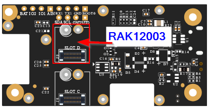</center>    

The RAK18001 is plugged into Slot B on the top of the RAK5005-O. I chose Slot B to have the buzzer controlled over IO2.   
<center>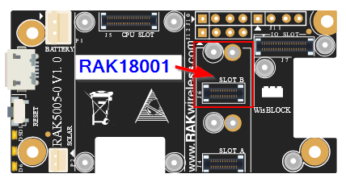</center>    

The RAK1921 OLED display is connected by some wires to the J12 connector on the RAK5005-O. And the buzzer is connected to GND and IO1 pins on J12 and J11:    
<center>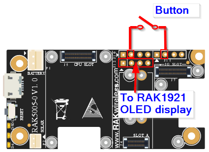</center>

## Enclosure
The enclosure was designed with Fusion 360. The 3D files in several formats can be found in the [3D-Files](./3D-Files) folder.    
The enclosure is made of 3 single parts.    
The lower parts holds the button and the WisBlock assembly.

| 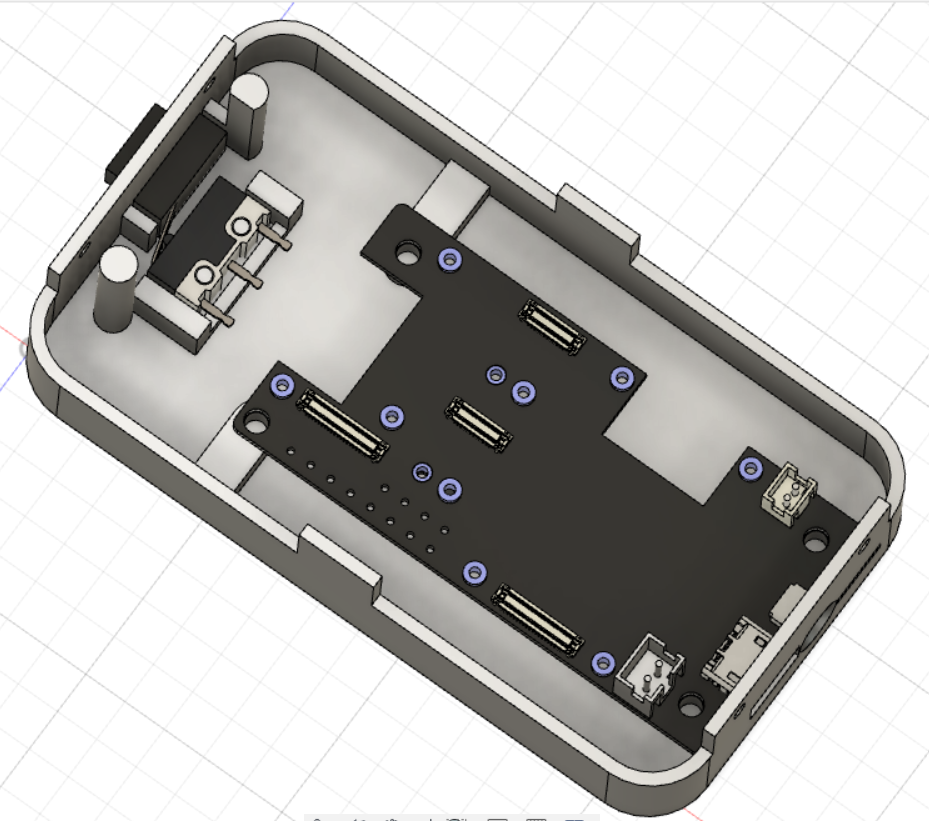 | 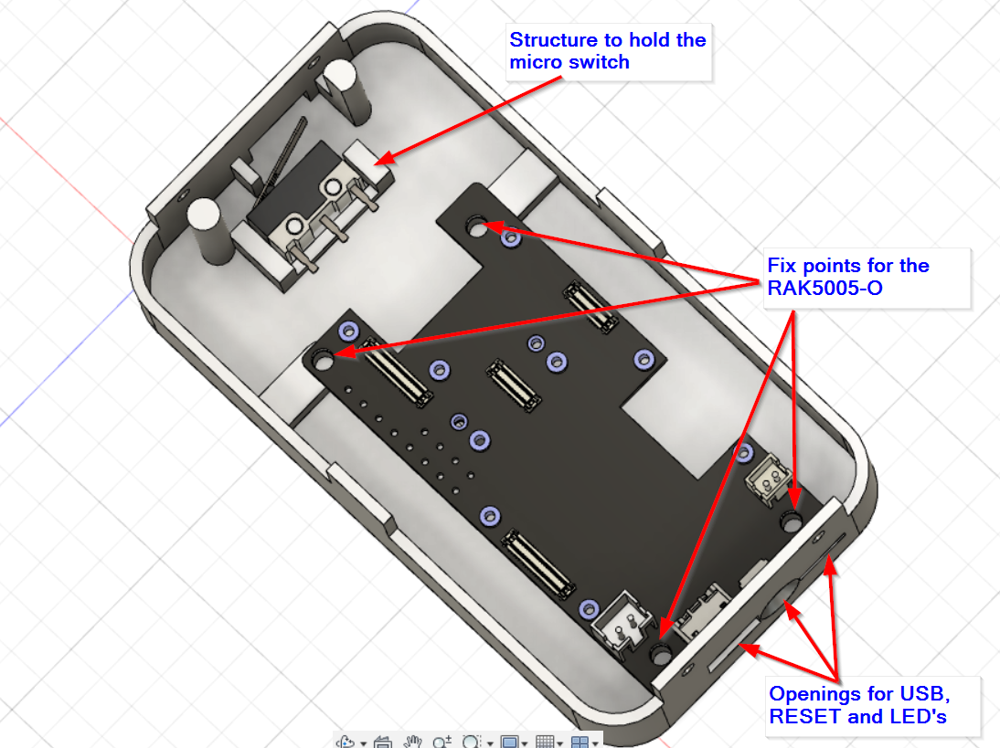 |
| :-: | :-: |
| 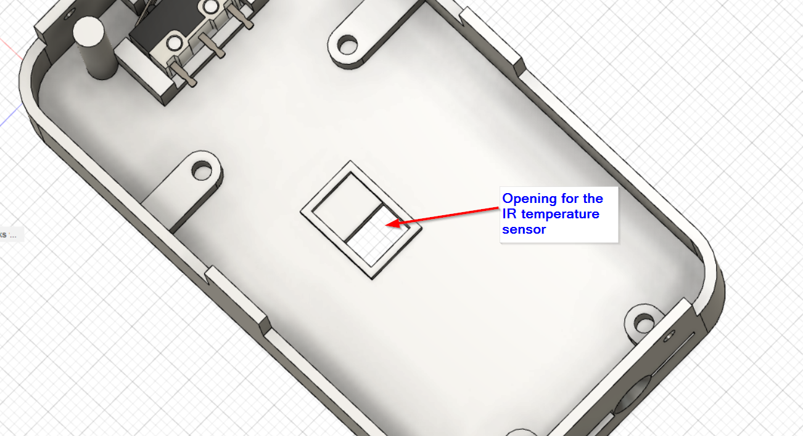 | 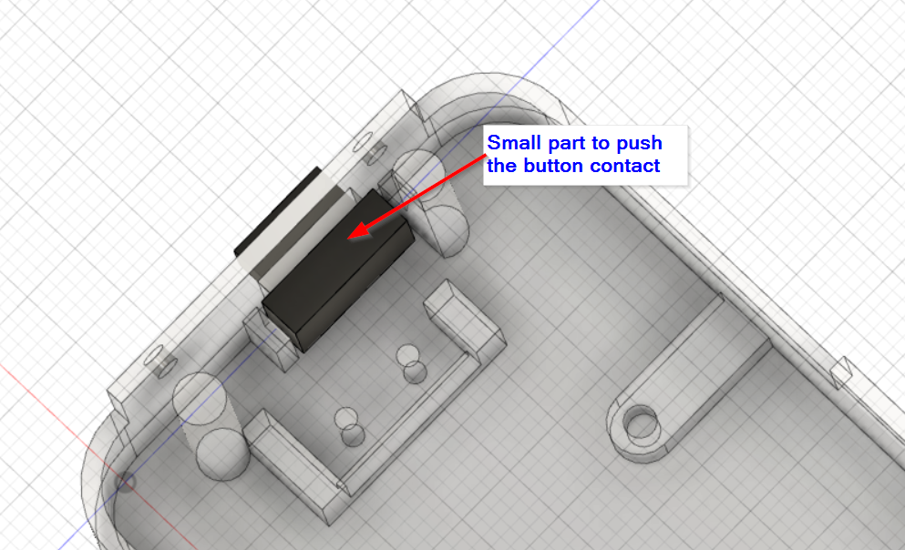 |

For the button I made a small extra part that extrudes from the enclosure and when pushed, triggers the button (Image on the right side).

The top part holds the OLED display and the battery.
| 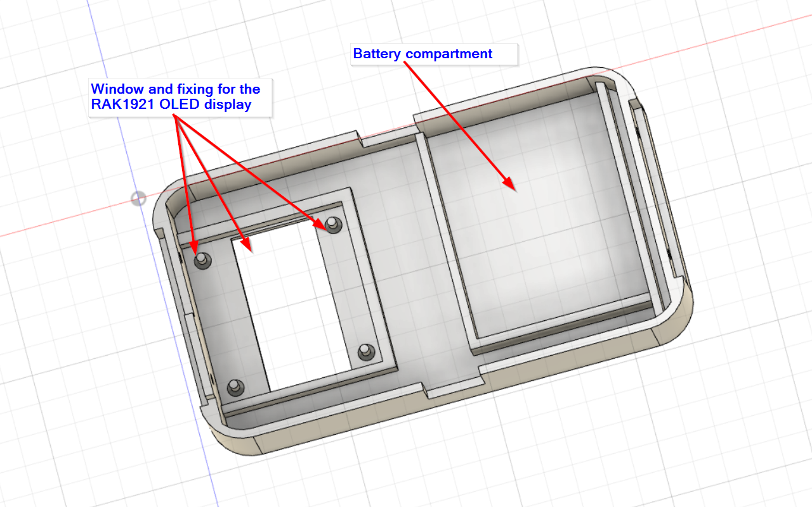 | 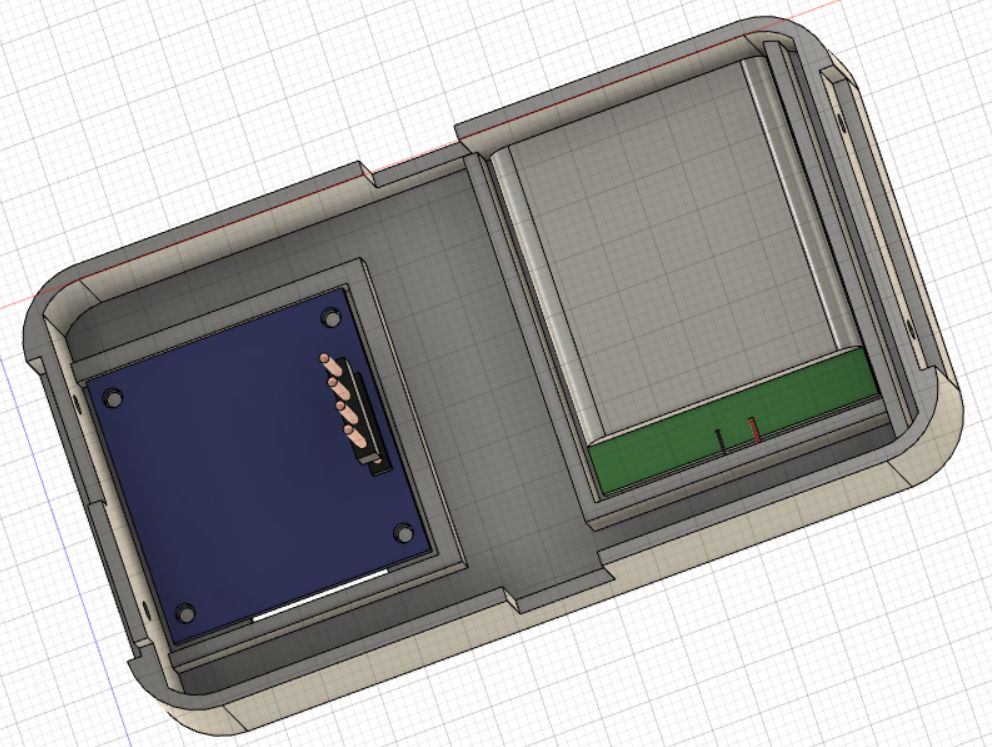 |
| :-: | :-: |

The assembly has overlaps on the shorter edges and can be screwed. And it has openings for the IR sensor. OLED, USB, Reset button and the LED's:
| 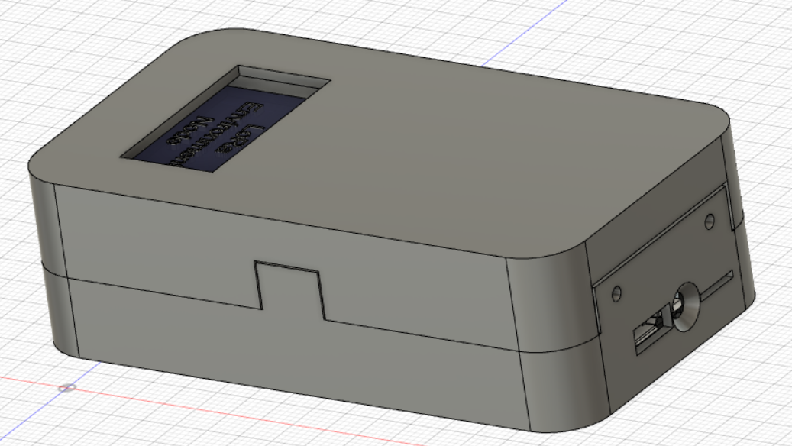 | 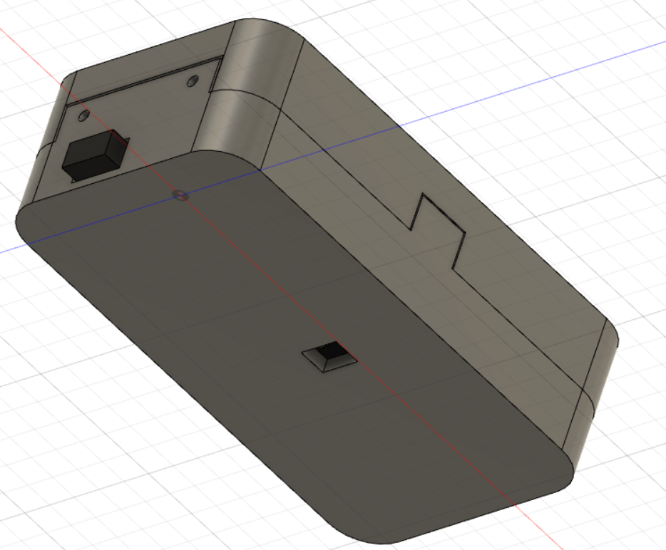 |
| :-: | :-: |

